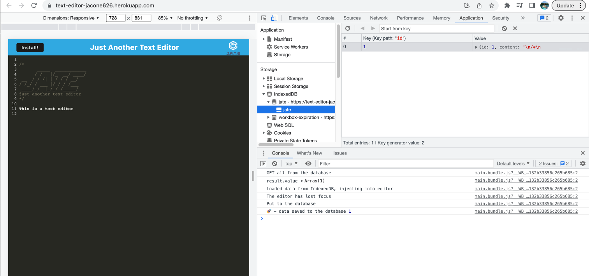

# Text-Editor

## Description
This application is a text editor that runs in the browser and can be installed and run offline. It was built with an IndexedDB database and meets PWA criteria.

## Installation
Click on the heroku link. If you would like to use offline, you have the option to install the application by clicking on the "install" button.

To use locally, clone the repo and run "npm i" in the root folder, client folder, and server folder. Then run "npm run start:dev" and navigate to localhost:3000 in your web browser.

## Usage
A user must navigate to the website by clicking on the heroku link provided. Once there, the user will see a homepage which displays the default JATE header.

On this page, you can then add and delete text. This text will persist when you refresh the page since it is stored within the IndexedDB database as well as local storage. 

Also within the console under the Application tab is the App Manifest. This is created when we run our webpack and contains information on defaults for when an application is launched.

Another tab under the Applications is called Service Workers. This service worker allows for offline access and improves the overall application performance.

A final feature of this application is that it can be installed by clicking on the "Install" button. This allows the user to have easier access to the application and puts an icon on your computer that links directly to the application. 

Below is a link to the deployed application:

https://text-editor-jacone626.herokuapp.com/

## Credits

N/A

## License
Please refer to the license in the repo.
